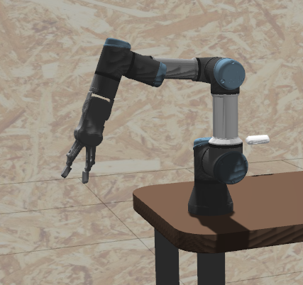

# The Construct's Checkpoint 13/14: manipulation_project

## Task 2   MoveIt2 C++ API 
Now that MoveIt2 is working with the robot arm, you will have to create a program that uses the MoveIt2 C++ API that instructs the arm to follow a pick and place sequence.

Create a package named moveit2_scripts and create inside it a C++ script named pick_and_place.cpp
Inside this C++ script, create a node that uses the move group interface to generate a pick & place sequence (see images below)
Create a launch file named pick_and_place.launch.py that starts your node.
The Pick&Place pipeline should perform the following sequence of motions:





### How to run
Terminal 1.

source ~/ros2_ws/install/setup.bash

ros2 launch the_construct_office_gazebo warehouse_ur3e.launch.xml


Terminal 2.

ros2 launch my_moveit_config move_group.launch.py


Terminal 3.

ros2 launch my_moveit_config moveit_rviz.launch.py


Terminal 4.

ros2 launch moveit2_scripts pick_and_place.launch.py


## Task 2.5   Test everything in the real robot lab 

Real Robot block position
target_pose.position.x = 0.343;
target_pose.position.y = 0.132;

How to run

Terminal 1.

ros2 launch real_moveit_config move_group.launch.py


Terminal 2.

ros2 launch real_moveit_config moveit_rviz.launch.py


Terminal 3.

ros2 launch moveit2_scripts pick_and_place_realrobot.launch.py

# Checkpoint 14
- Make sure the camera is publishing a point cloud in the topic /wrist_rgbd_depth_sensor/points. with RViz2. You can use RViz2 to verify it:


```
ros2 launch get_cube_pose get_pose_client.launch.py
```
```
ros2 launch my_moveit_config move_group.launch.py
```
```
ros2 launch my_moveit_config moveit_rviz.launch.py
```
```
ros2 launch moveit2_scripts pick_and_place_perception.launch.py
```
## Working with real robot


```
cd ~/ros2_ws/src/zenoh-pointcloud/
./install_zenoh.sh
cd ~/ros2_ws/src/zenoh-pointcloud/init/
./zenoh_pointcloud_rosject.sh
```
Getting position of the Block
```
ros2 launch get_cube_pose get_pose_client_realrobot.launch.py 
```
```
ros2 launch real_moveit_config move_group.launch.py
```
```
ros2 launch real_moveit_config moveit_rviz.launch.py
```
```
ros2 launch moveit2_scripts pick_and_place_perception_real.launch.py
```